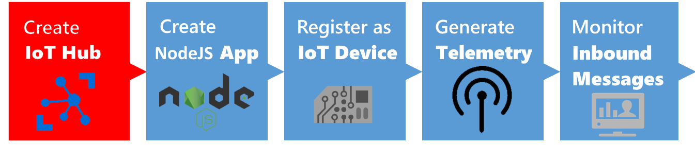
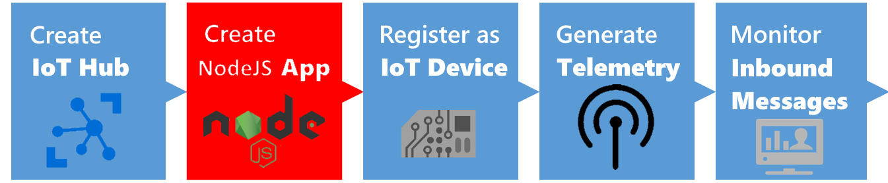
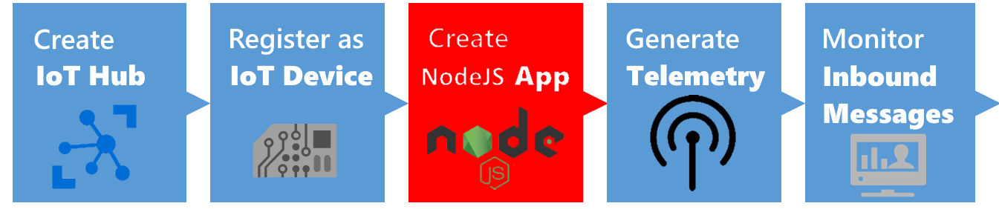
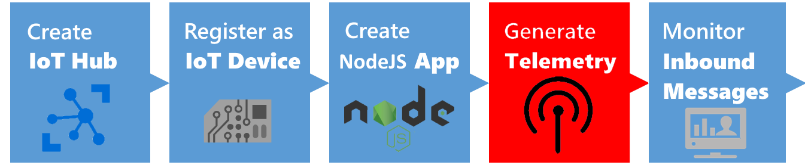
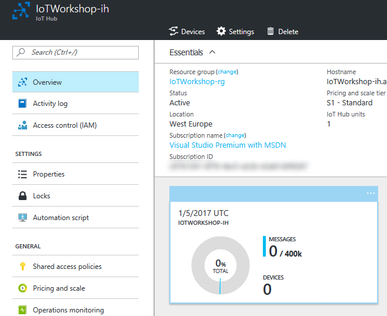
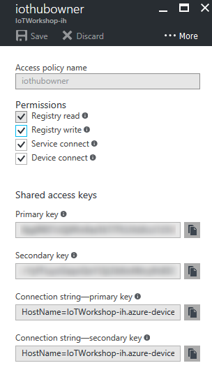

## Connecting to an IoT Hub using a NodeJs app device simulation


This is an example integration between a NodeJs app and Azure IoT Hub. This integration shows features like creating devices in the Azure IoT Hub device registry as well as sending telemetry to the IoT Hub.

*Note: In this workshop, we will create uniquely named Azure resources. The suggested names could be reserved already. Just try another unique name.*

*Note: The IoT Hub also offers the ability to send commands back to devices. This is not part of this workshop.*

### Prerequisites

1. A Windows 7+ computer with internet access
2. Node.js [https://nodejs.org/en/](https://nodejs.org/en/). _(We prefer Version 6)_
3. Azure account [create here](https://azure.microsoft.com/en-us/free/) _([Azure passes](https://www.microsoftazurepass.com/howto) will be present for those who have no Azure account (please check your email for final confirmation))_
4. [IoT Hub Explorer](https://www.npmjs.com/package/iothub-explorer) _(for Command-Line interface based usage; see below for installation steps)_ or [Device Explorer](https://github.com/fsautomata/azure-iot-sdks/blob/master/tools/DeviceExplorer/doc/how_to_use_device_explorer.md) _(for GUI based usage; see below for installation steps)_  

### Objectives

In this workshop, you will learn:

1. Creating an IoT Hub in the Azure Portal
2. Creating a new NodeJs app
3. Connect to the IoT Hub and register the app like a device
4. Generate and send dummy telemetry
5. Check the arrival of the telemetry

## Creating an Azure IoT Hub in the Azure portal



Follow these steps to create an Azure IoT Hub.

1. Log into the [Azure portal](https://portal.azure.com/). You will be asked to provide Azure credentials if needed
2. On the left, a number of common Azure services are shown. Select `More Services` to open a list with all available services

    

3. Filter it with `IoT Hub`

    

4. Select `IoT Hub` and a new blade will be shown. Select `Add` and you will be asked to enter the information needed to create an IoT Hub

    

5. Enter a unique IoT Hub name eg. `IoTWorkshop-ih`. A green sign will be shown if the name is unique
6. Enter a unique Resource Group eg. `IoTWorkshop-rg`. A green sign will be shown if the name is unique
7. Select `West Europe` for the location, if needed

    

8. Press `Create` and the portal will start creating the service. Once it is created, a notification is shown. In the right upper corner, a bell represents the list of all notifications shown

    

Creating an IoT Hub takes some time. Meanwhile, we will start with the app which will connect to the IoT Hub later on.


## Connect to the IoT Hub and register the app like a device



Unlike event hubs, all devices that use an IoT hub must be individually registered, and use their own endpoint and shared access key to access the hub. In this exercise, you will register a client device.

### Get the Hostname and Connection String for the Hub

To register a client device, you must run a script that uses a connection with sufficient permissions to access the hub registry. In this case, you will use the built-in iothubowner shared access policy to accomplish this.

1. In the Azure portal, browse to the IoT Hub you created previously.
2. In the blade for your IoT Hub, click Shared access policies.
3. In the Shared access policies blade, click the iothubowner policy, and then copy the connection string-primary key for your IoT Hub to the clipboard – you will need this later.

```javascript
Note: For more information about access control for IoT hubs, see [Access control](https://azure.microsoft.com/en-us/documentation/articles/iot-hub-devguide-security/) in the "Azure IoT Hub developer guide."
```

### Create a Device Identity

Each device that sends data to the IoT hub must be registered with a unique identity.

1. Open a Node.JS console and navigate to the createdeviceid folder in the folder where you extracted the lab files.
2. Enter the following command, and press RETURN to accept all the default options. This creates a package.json file for your application:
```javascript
npm init
```
3. Enter the following command to install the Azure IoT Hub package:
```javascript
npm install azure-iothub
```
4. Use a text editor to edit the createdeviceid.js file in the createdeviceid folder.
5. Modify the script to set the connStr variable to reflect the shared access policy connection string for your IoT Hub, as shown here:
```javascript
'use strict';
var iothub = require('azure-iothub');
var connStr = '<IOT-HUB-CONNECTION-STRING>';
var registry = iothub.Registry.fromConnectionString(connStr);
var device = new iothub.Device(null);
device.deviceId = 'MachineCyclesNodeJs';

registry.create(device, function(err, deviceInfo, res) {
  if (err) {
    registry.get(device.deviceId, printDeviceInfo);
  }
  if (deviceInfo) {
    printDeviceInfo(err, deviceInfo, res)
  }
});

function printDeviceInfo(err, deviceInfo, res) {
  if (deviceInfo) {
    console.log('Device id: ' + deviceInfo.deviceId);
  }
}
```
6. Save the script and close the file.
7. In the Node.JS console window, enter the following command to run the script:
node createdeviceid.js
8. Verify that the script registers a device with the ID MachineCyclesNodeJs.
9. In the Azure portal, on the blade for your IoT Hub, click the Overview tab and then at the top of the blade, click Devices and verify that MachineCyclesNodeJs is listed.
10. Click MachineCyclesNodeJs and view the device-specific keys and connection strings that have been generated. Then copy the connection string-primary key for MachineCyclesNodeJs to the clipboard. You will use this in the next exercise.


## Creating a new NodeJs App




## Generate and send dummy telemetry



We will use the connection later on. But first let's check out the 'AzureIoTHub.cs' file because it needs some rework.

1. `Open` the file named 'AzureIoTHub.cs'
2. The file contains a class named which has two methods: 'SendDeviceToCloudMessageAsync' and 'ReceiveCloudToDeviceMessageAsync'. *Note: receiving Cloud to Device messages will be discussed later on*
3. The method to send data is not that intelligent. It only sends a text message. `Add the following code` just below it

    ```csharp
    public static async Task SendDeviceToCloudMessageAsync(Telemetry telemetry)
    {
     var deviceClient = DeviceClient.CreateFromConnectionString(deviceConnectionString, TransportType.Amqp);

        var message = new Message(Encoding.ASCII.GetBytes(Newtonsoft.Json.JsonConvert.SerializeObject(telemetry)));

        await deviceClient.SendEventAsync(message);
    }

    public class Telemetry
    {
        public int errorCode { get; set; }

        public int numberOfCycles { get; set; }
    }
    ```

4. We have defined the Telemetry class which will hold the number of cycles. And the current error code of the device can be passed to the cloud. The telemetry is converted to JSON
6. `Open` the 'XAML' file named 'MainPage.xaml'. The empty page will be shown both in a visual editor and a textual XAML editor
7. The page contains one component, a grid. But that grid is merely a container for other visual components
8. In the XAML editor, within the grid, `add`

    ```xml
    <StackPanel>
        <TextBlock Name="txbTitle" Text="Machine Cycles Demo" Margin="5"  FontSize="100" IsColorFontEnabled="True" Foreground="DarkOliveGreen" />
        <Button Name="BtnSend" Content="Send cycle updates" Margin="5" FontSize="60" Click="btnSend_Click" />
        <Button Name="BtnBreak" Content="Break down" Margin="5" FontSize="60" Click="BtnBreak_OnClick" />
        <TextBlock Name="TbMessage" Text="---" FontSize="60" />
    </StackPanel>
    ```

9. Three buttons and two text blocks are put on the screen. Go to the code-behind source code which will be executed when the buttons are clicked. 
10. Press `F7`, the file 'MainPage.xaml.cs' is shown. 
11. Only the constructor of this page is shown. `Add` the following members and methods 

    ```csharp
    private int _cycleCounter;

    private int _errorCode;

    private async void btnSend_Click(object sender, RoutedEventArgs e)
    {
        try
        {
            await ShowMessage("Sending...");

            if (_errorCode == 0)
            {
                _cycleCounter++;
            }

            var t = new AzureIoTHub.Telemetry
            {
                errorCode = _errorCode,
                numberOfCycles = _cycleCounter,
            };

            await AzureIoTHub.SendDeviceToCloudMessageAsync(t);

            await ShowMessage($"Telemetry sent (Cycle: {_cycleCounter}, State: {_errorCode})");
        }
        catch (Exception ex)
        {
            await ShowMessage(ex.Message);
        }
    }

    private async Task ShowMessage(string text)
    {
        await Dispatcher.RunAsync(
                CoreDispatcherPriority.Normal, () =>
                {
                    TbMessage.Text = text;
                });
    }

    private async void BtnBreak_OnClick(object sender, RoutedEventArgs e)
    {
        try
        {
            BtnBreak.IsEnabled = false;

            _errorCode = 99;

            txbTitle.Foreground = new SolidColorBrush(Colors.Red);

            await ShowMessage("Machine is now broken, cycles have stopped; have to Notify!");
        }
        catch (Exception ex)
        {
            await ShowMessage(ex.Message);
        }
    }
    ```

12. The method 'btnSend_Click' now increases the number of duty cycles and sends it to the IoT Hub using the unique access token of the device 'MachineCyclesUwp'
13. New libraries references are introduced in this code. `Add` two times a 'using' at the top of the editor

    ```csharp
    using System;
    using System.Threading.Tasks;
    using Windows.UI;
    using Windows.UI.Core;
    using Windows.UI.Xaml;
    using Windows.UI.Xaml.Controls;
    using Windows.UI.Xaml.Media;
    ```

14. The app is now ready. `Run` the app and first send some cycle updates. It the message 'Telemetry sent' is shown, our telemetry is accepted by the IoT Hub

    

Now we have sent telemetry to the Event Hub. Let's check if it's arrived.

## Monitoring the arrival of the telemetry in Azure

We can monitor the arrival of telemetry only if we have enough rights to look into the IoT Hub. So first we collect secrets.

### Collect Azure IoT Hub secrets

The integration requires an Azure IoT Hub Shared access policy key name with `Registry read, write and Device connect` permissions. In this example, we use the **iothubowner** policy which has these permissions enabled by default.

1. Check the Azure portal. The resource group and the IoT Hub should be created by now (otherwise, we were unable to send duty cycles information to it)

    

2. On the left, select `Resource groups`. A list of resource groups is shown

    

3. Select the resource group `IoTWorkshop-rg`. It will open a new blade with all resources in this group
4. Select the IoT Hub `IoTWorkshop-ih`. It will open a new blade with the IoT Hub

    

5. The IoTHub has not received any messages yet. Check the general settings for `Shared access policies`

    

6. **Write down** the `name` of the IoT Hub eg. `IoTWorkshop-ih`
7. Navigate to the 'iothubowner' policy and **write down** this `Connection String-Primary Key`

    

This is the secret needed from the Azure IoT Hub.

## Select your favorite tool for monitoring


We can check the arrival of messages in the Azure IoT Hub. This can be done using a UI app named Device Explorer or using a Command-Line tool named IoT Hub Explorer. `Choose one below` 

### Monitoring using UI

We can check the arrival of the messages in the Azure IoT Hub using the Device Explorer.

The Device Explorer tool is a Windows-only graphical tool for managing your devices in IoT Hub.

The easiest way to install the Device Explorer tool in your environment is to download the pre-built version by clicking [Azure IoT SDKs releases](https://github.com/Azure/azure-iot-sdks/releases). Scroll down to the Downloads section to locate the download link for the SetupDeviceExplorer.msi installer. Download and run the installer.

To run the Device Explorer tool, double-click the DeviceExplorer.exe file in Windows Explorer. The default installation folder for this application is C:\Program Files (x86)\Microsoft\DeviceExplorer.

1. Start the `Device Explorer` from the desktop or using the start menu
2. On the Configuration Tab, insert the IoT Hub `Connection String-primary key` and the `name` of the IoT Hub (as Protocol Gateway Hostname)
3. Press `Update`
4. On the Management tab, your device should already be available. It was registered by the bridge the very first time, telemetry arrived

    

5. On the Data tab, Select your `Device ID` (like 'MachineCyclesUwp') and press `Monitor`
6. in the UWP app, press `Send cycle updates` a couple of times
7. This will result in the following messages when you send some Duty Cycle telemetry in your UWP app

    ```
    Receiving events...
    1/5/2017 9:46:18 PM> Device: [MachineCyclesUwp], Data:[{"errorCode":0,"numberOfCycles":1}]
    1/5/2017 9:46:19 PM> Device: [MachineCyclesUwp], Data:[{"errorCode":0,"numberOfCycles":2}]
    1/5/2017 9:46:20 PM> Device: [MachineCyclesUwp], Data:[{"errorCode":0,"numberOfCycles":3}]
    ```

### Monitoring using Command-line

We can check the arrival of the messages in the Azure IoT Hub using the IoT Hub Explorer. This tool is Command-Line based, please check the installation requirements. 

*Note : See the [full example](https://www.npmjs.com/package/iothub-explorer) for more options of this tool.*

1. Create a new folder eg. `c:\iothubexplorer`
2. In a dos-box (press Windows button-R, type CMD and enter), navigate to the new folder `c:\iothubexplorer`
3. In this folder, run the following command `npm install -g iothub-explorer@latest` in your command-line environment, to install the latest (pre-release) version of the iothub-explorer tool
4. Login to the IoT Hub Explorer by supplying your *remembered* IoT Hub `Connection String-primary key` using the command `iothub-explorer login "[your connection string]"`
5. A session with the IoT Hub will start and it will last for approx. one hour:

    ```
    Session started, expires on Thu Jan 05 2017 22:53:55 GMT+0100 (W. Europe Standard Time)
    ```

6. To monitor the device-to-cloud messages from a device, use the following command `iothub-explorer monitor-events --login [your connection string]` and `fill in` your *remembered* IoT Hub 'Connection String-primary key'
7. All devices are monitored now. This will result in the following messages

    ```
    Monitoring events from all devices...
    From: MachineCyclesUwp
    {
      "errorCode": 0,
      "numberOfCycles": 8
    }
    -------------------
    From: MachineCyclesUwp
    {
      "errorCode": 0,
      "numberOfCycles": 9
    }
    -------------------
    ```

## Conclusion

These messages shown during the monitoring step are now available in Azure, and kept in the IotHub until other resources are asking for telemetry...

Next Step: You are now ready to process your data in an Azure Function. Continue to [Receivig and handling telemetry in Azure](Azure.md)


